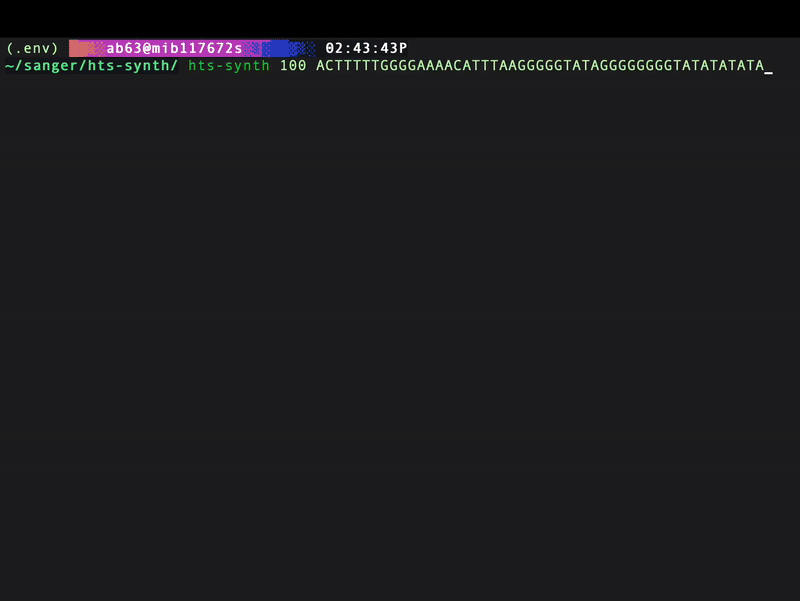
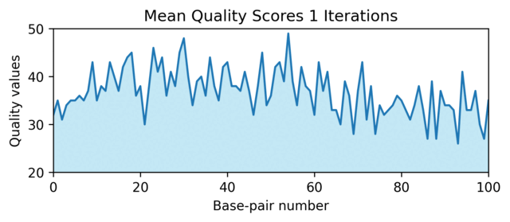

[](https://docs.python.org/3.12/)
[](https://docs.astral.sh/ruff/)
[](LICENSE.txt)
[](https://blex-max.github.io/hts-synth/)

# hts-synth

Biodev Hackathon 2025 - constrained generation of HTS data for testing and exploration.

## Installation

```sh
python -m venv .venv
. .venv/bin/activate
pip install -e .
```

## Usage

The synthesising tool can be used both as a Faker provider for unit tests and as a command-line data generator.

### Command line usage

```sh
$ hts-synth --help

$ hts-synth ATCGATCGATCG
@read-d094e5d1-cf29-4b
ATCGATCGATCG
+
!!!!!!!!!!!!
```



## Examples

There are usage examples in ./examples. To successfully run the Jyputer notebook, install development the requirements and acquire a FASTQ file for testing. The one that was tested against contains 25 000 reads, each 100 bps long. See [TESTX_H7YRLADXX_S1_L001_R1_001.fastq](https://github.com/hartwigmedical/testdata/tree/master/100k_reads_hiseq/TESTX).



## Development

### Requirements

- Python 3.12+
- Pyenv (optional)
- [Pysam](https://github.com/pysam-developers/pysam)

### Setup

From the repo's base directory

```sh
pyenv install 3.12
python3 -m venv .venv
source ./.venv/bin/activate
pip install -r requirements.txt
pip install -r requirements-dev.txt
```

## Contributing

The followng checks are automatically run by pre-commit.
If this is the first time you're commiting to this repo, ensure your pre-commit is configured.

Note: you will need to have an SSH public keyadded to your GitHub profile.

```bash
source ./.venv/bin/activate
pre-commit
```

### Linting and Typing

Ruff is used for linting

```sh
python -m ruff format
python -m ruff check --fix
```

Basedpyright for typing

```sh
python -m basedpyright
```

### [Documentation](https://blex-max.github.io/hts-synth/)
Documentation is generated using Sphinx on every commit to the main branch.

#### Updating the documentation

The documentation source files are located in the `docs/source/` directory:

- **Main documentation files**: `docs/source/` contains reStructuredText (.rst) files
  - `index.rst` - Main documentation page
  - `user_docs/` - User documentation pages
  - `api/` - Auto-generated API documentation
- **Configuration**: `docs/source/conf.py` - Sphinx configuration file
- **Static assets**: `docs/source/_static/` - Custom CSS and other static files
- **Images**: `docs/source/images/` - Documentation images

To update the documentation:
1. Edit the relevant `.rst` files in `docs/source/`
2. Add new images to `docs/source/images/`
3. Update `docs/source/conf.py` for configuration changes
4. Generate locally to preview changes (see Local Generation below)
5. Commit your changes - documentation will be automatically updated online

#### Local Generation
To generate the documentation locally using Sphinx, run the following commands:

```sh
python -m pytest
# or
pytest .
```

### Authors

- Alex Byrne - Wellcome Sanger Institue (ab63 (at) sanger.ac.uk - Lead Developer/Contact)
- Helen Schuilenburg - Wellcome Sanger Institue (hs21 (at) sanger.ac.uk)
- Hitham Hassan - Wellcome Sanger Institue (hh12 (at) sanger.ac.uk)
- Luca Barbon - Wellcome Sanger Institue (lb29 (at) sanger.ac.uk)
- Rose Neis - EMBL-EBI (rneis (at) ebi.ac.uk)
- Stephen N. Hulme - Wellcome Sanger Institue (stephen.hulme (at) sanger.ac.uk)
- Tom Drever - Wellcome Sanger Institue (td14 (at) sanger.ac.uk)
- Willem S. van Heerden - Wellcome Sanger Institue (wh5 (at) sanger.ac.uk)